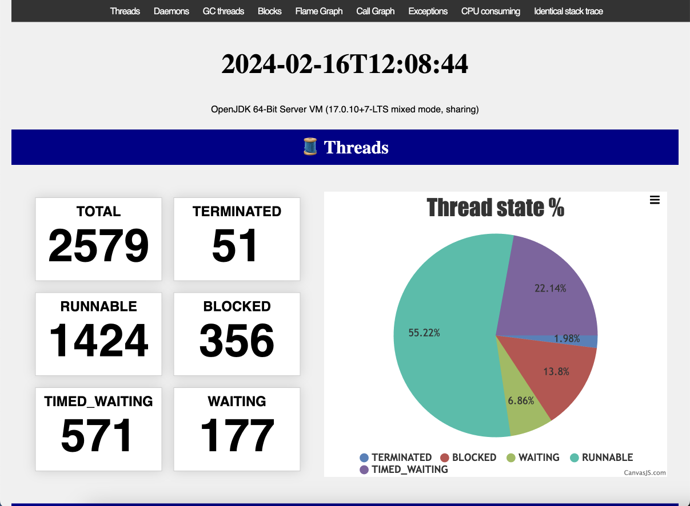
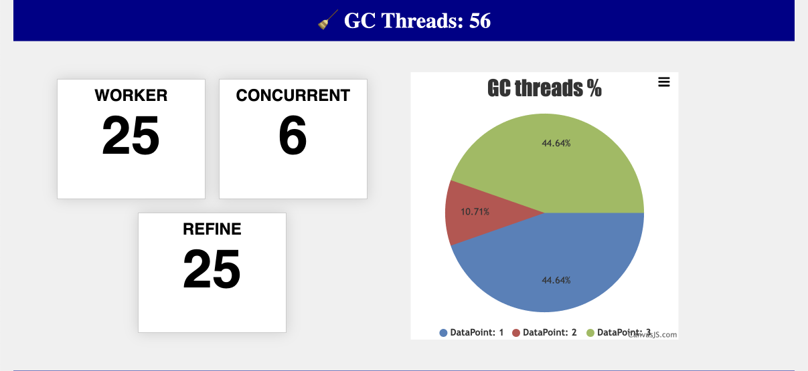
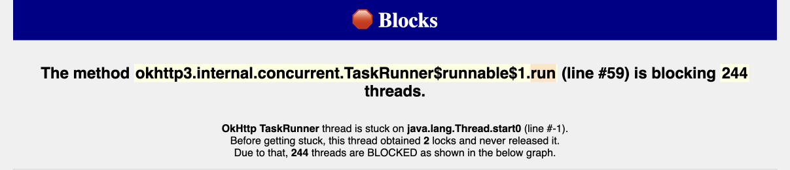
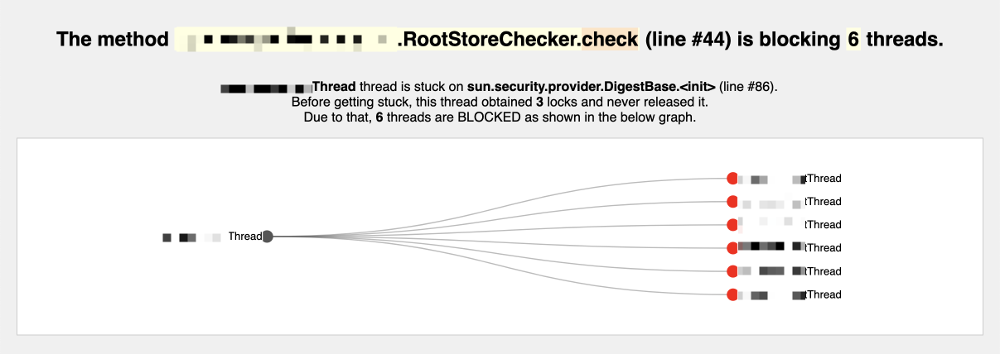
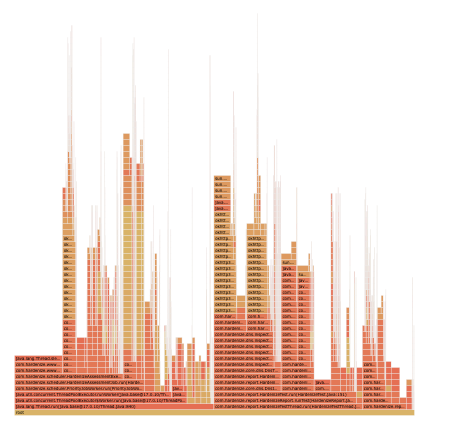
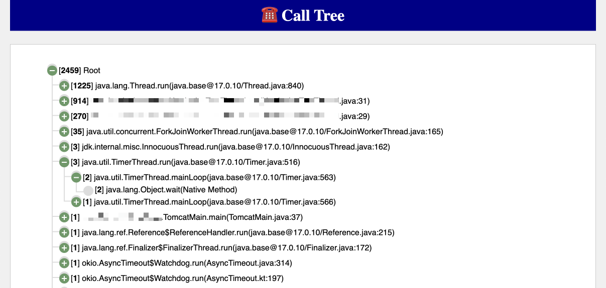
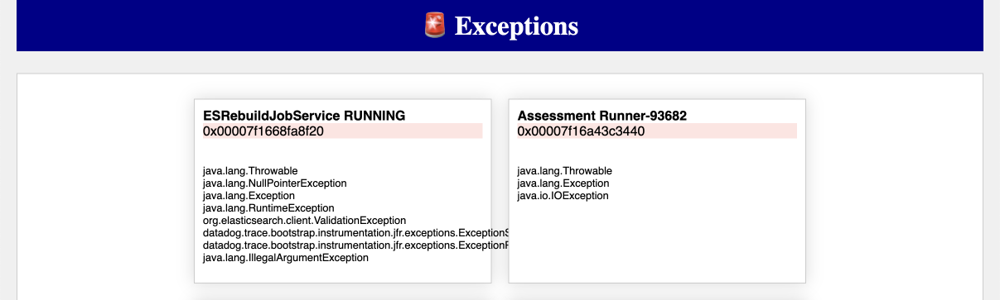
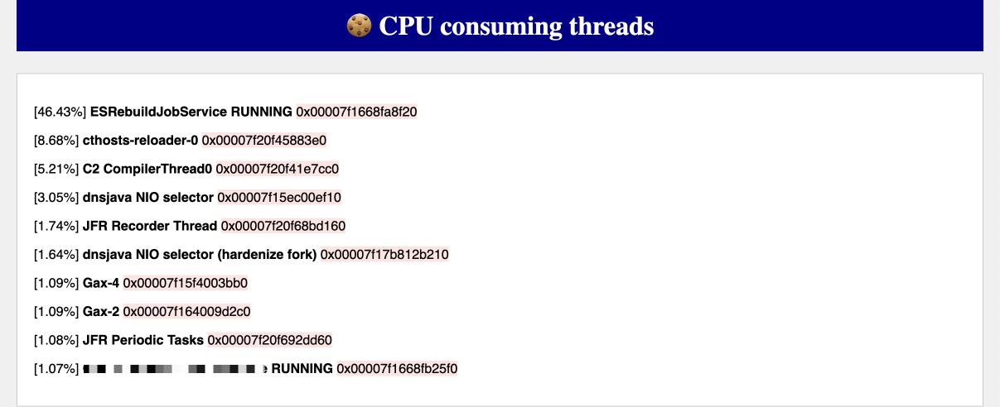
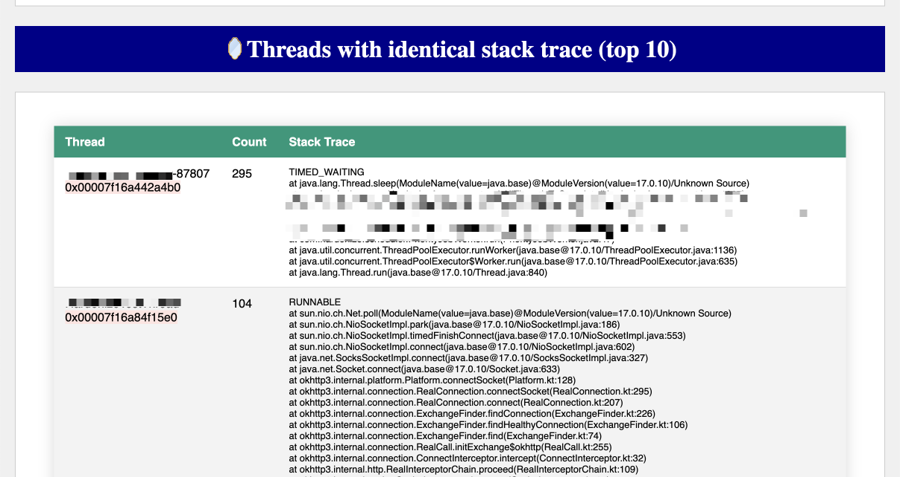

# Thread Dump Viewer

version: `0.1.0`

🚀 **Offline** Thread Dump Analyzer.

Disclaimer: I am making this for my own use.
I have no intention of making it a full-fledged tool 🤷‍♂️.

☕️ You can still [buy me a coffee](https://www.buymeacoffee.com/oblac) :)

## Usage

Download the fat jar and run it:

```shell
java -jar tdv-0.1.0-all.jar <thread-dump-file>
```

The report will be generated in the `out` subfolder as HTML file.
It is a huge report, and it is not beautiful, but it is functional.

## TDV Report

The report will contain the following sections:

### 🧵 Threads stats



### 😈 Daemon stats


### 🧹 GC stats



### 🛑 Blocks

Analysis of all the blocks in the thread dump.
Finds locks and all the threads that are waiting for them.



For each lock generates a report and  a graph like this (redacted for privacy):



### 🔥 Flamegraph

Interactive flamegraph of the thread stack traces.



### ☎️ Call Tree



### 🚨 Exceptions

All captured exceptions.



### 🍪 CPU consuming threads

Sort threads by CPU consumption.



### 🪞 Threads with identical stack trace



## TODO

+ [ ] Detect thread pools
+ [ ] Add deadlocks detection (as soon as I get a thread dump with a deadlock)
+ [ ] Detect complex deadlocks (e.g. A -> B -> C -> A)
+ [ ] Make thread histogram per priorities
