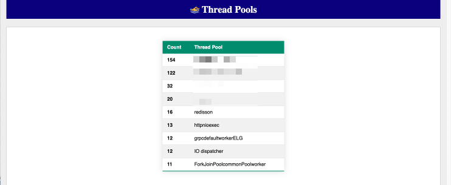

# Thread Report

> ⚠️ The screenshots are NOT up-to-date and may be missing.

## 🧵 Threads stats

+ ALL threads
+ Application threads
+ System threads

## 😸 Tomcat

If Tomcat is detected, there will be a section with Tomcat stats: for all Tomcat threads, and only for **Tomcat executor pool**.

## 😈 Daemon stats

## 🧹 GC stats

## 🏊‍♂️ Pools

Resolve thread pools from similar thread names.

## 🛑 Blocks

Analysis of all the blocks in the thread dump.
Finds locks and all the threads that are waiting for them.

For each lock generates a report and  a graph like this (redacted for privacy):

## 🔥 Flamegraph

Interactive flamegraph of the thread stack traces.

## ☎️ Call Tree

## 🚨 Exceptions

All captured exceptions.

## 🍪 CPU consuming threads

Sort threads by CPU consumption.

## 🪞 Threads with identical stack trace

## 🔍 List of missing locks
